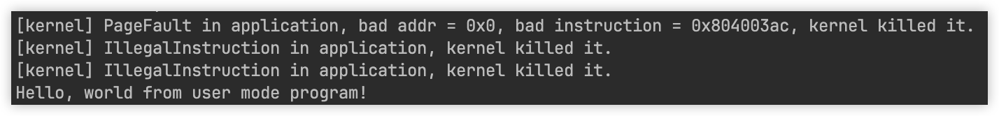

# Lab 1 实验报告

## 编程作业

题目要求是实现 `sys_task_info()` 系统调用函数，该函数返回当前正在执行的任务的 `TaskInfo`。

`TaskInfo` 中统计的信息有：

- `syscall_times[]`，该任务调用的每个 syscall 的次数；
- `time`，该任务从第一次开始执行到当前所经历的时间。

这两个信息在框架中都没有维护，需要我们自己编写代码维护。

阅读框架代码后发现，任务是存储在 `TaskManager` 中，因此我们考虑在这里面新建变量来维护这两个信息。至于为什么不在 `TaskControlBlock` 中维护，是因为 TCB 维护的是任务的状态，而这两个信息和任务的状态没有太多的关系。

我们可以用一个二维数组存储每个任务的 `syscall_times[]`，一个一维数组来存储每个任务第一次开始执行的时间点，`time` 就等于当前时间减去这个值。除此之外，还需要新建对应的 getter 函数，来根据 `current_task` 返回当前任务的信息。

接下来是何时更新这两个值。

`time` 需要在线程第一次被执行的时候赋值，因此需要在 `run_first_task()` 和 `run_next_task()` 中更新，每次更新需要判断该值是否被赋值过，若没有赋值过才进行赋值，因为我们维护的是第一次执行的时间点。

而 `syscall_times[]` 则是在 `syscall()` 中直接更新就好了。为了代码的安全性，我们最好在 `TaskManager` 中新建一个函数，根据 `syscall_id` 增加对应的值，而不是直接把 `syscall_times` 设成 `pub`。

最后，只需要在 `sys_task_info` 中调用对应的函数，创建新的 `TaskInfo` 返回就好了。

## 简答题

### 第一题

如下图所示，从上到下依次是 `ch2b_bad_address.rs`、`ch2b_bad_instructions.rs` 和 `ch2b_bad_register.rs` 的输出内容。最后一个是 `ch2b_hello_world.rs`，能够正常运行。

可以看到，第一个程序触发了 `StoreFault`，因为其试图访问一个非法的内存地址。后面两个触发了 `IllegalInstruction`，代表处理器尝试执行一个不存在的指令，这是因为当前处理器运行在 U 态，而程序想要执行 S 态指令。

我使用的 RUST-SBI 版本是 `0.2.0-alpha.2`。

### 第二题

1. `a0` 是调用的返回值。换栈的时候不会修改 `a0` 的值。两种使用场景：系统调用后返回 U 态，发生异常中断后返回 U 态。
2. 处理了 `sstatus`、`sepc` 和 `sscratch` 这三个 CSR 寄存器。
    - `sstatus`：这是用来表示目前处理器的状态的寄存器，包含中断使能、特权级等信息，返回 U 态的时候需要恢复之前的状态。
    - `sepc`：存放着发生中断时候的 pc 的值，在返回 U 态的时候需要重新加载进 pc 里。
    - `sscratch`：存储了 U 态的通用寄存器的值，在返回 U 态的时候需要复原。
3. `x2` 是 `sp` 栈指针，`x4` 是 `tp` 线程指针，都是最后再单独处理。
4. `sp` 此时是 U 态的栈指针，`sscratch` 是 S 态的栈指针。
5. 是第 60 行，执行完这条指令后，当前的栈指针 `sp` 会指向 U 态的栈，此时就完成了 S 态到 U 态的切换。
6. `sp` 此时是 S 态的栈指针，`sscratch` 是用户态的栈指针。
7. 是第 13 行，原因第 5 问。

## 资料

### RV32I 通用寄存器

| 寄存器   | ABI 名字  | 描述 | Saver  |
| ------- | -------- | ----------------- | ------ |
| x0      | zero     | 0值寄存器，硬编码为0,写入数据忽略，读取永远为0  | - |
| x1      | ra       | 返回地址 | Caller |
| x2      | sp       | 栈指针 | Callee |
| x3      | gp       | 全局指针 | - |
| x4      | tp       | 线程指针 | - |
| x5      | t0       | 临时寄存器或者备用的链接寄存器 | Caller |
| x6-x7   | t1-t2    | 临时寄存器 | Caller |
| x8      | s0/fp    | 需要保存的寄存器或者帧指针寄存器 | Callee |
| x9      | s1       | 需要保存的寄存器，保存原进程中的关键数据，避免在函数调用过程中被破坏 | Callee |
| x10-x11 | a0-a1    | 函数参数/返回值 | Caller |
| x12-x17 | a2-a7    | 函数参数 | Caller |
| x18-x27 | s2-s11   | 需要保存的寄存器 | Callee |
| x28-x31 | t3-t6    | 临时寄存器 | Caller |

## 荣誉准则

1. 在完成本次实验的过程（含此前学习的过程）中，我曾分别与 以下各位 就（与本次实验相关的）以下方面做过交流，还在代码中对应的位置以注释形式记录了具体的交流对象及内容：
    > 无
2. 此外，我也参考了 以下资料 ，还在代码中对应的位置以注释形式记录了具体的参考来源及内容：
    > 无
3. 我独立完成了本次实验除以上方面之外的所有工作，包括代码与文档。 我清楚地知道，从以上方面获得的信息在一定程度上降低了实验难度，可能会影响起评分。
4. 我从未使用过他人的代码，不管是原封不动地复制，还是经过了某些等价转换。 我未曾也不会向他人（含此后各届同学）复制或公开我的实验代码，我有义务妥善保管好它们。 我提交至本实验的评测系统的代码，均无意于破坏或妨碍任何计算机系统的正常运转。 我清楚地知道，以上情况均为本课程纪律所禁止，若违反，对应的实验成绩将按“-100”分计。
