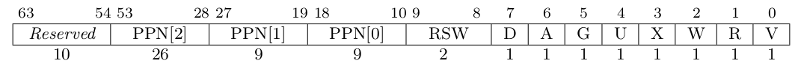

# Lab 2 实验报告

## 编程作业

首先，对于 `sys_get_time()` 和 `sys_get_info()` 这两个函数，其参数传进来的是用户地址空间的指针，而我们处理 syscall 是在内核地址空间，所以不能直接解引用，否则就会访问非法的内存，从而导致一些未定义问题。

我就在这里栽了跟头，一开始和 lab1 一样直接解引用，然后发现系统会死循环，而且在我每次改动了一些代码之后，出现的问题还不一样，有的时候会触发 PageFault，有的时候又是触发 trap_from_kernal。所以我以为是缺页或者内核态中断的问题。实际上，这是因为直接在内核态解引用用户态传进来的指针，导致可能修改了代码段之类的地方，造成的问题。

所以我们需要用任务的 satp 来访问用户态的页表，找到对应的物理地址，然后才能进行修改。而框架已经提供了这个函数：

```rust
pub fn translated_byte_buffer(token: usize, ptr: *const u8, len: usize) -> Vec<&'static mut [u8]> {}
```

其第一个参数是用户态的 satp，第二个参数是需要转换的指针，第三个参数是类型的大小。该函数会返回一个 u8 切片 Vec。这个 Vec 可能有多个元素，每个元素是一个 u8 数组，代表一个物理页内的有效区域。

由于变量可能跨过物理页的边界，而物理页可能并不是连续的，而是分开的，所以需要将我们需要写进去的数据分成一段一段的。可以使用 `core::ptr::copy_nonoverlapping()` 来实现。具体代码就不详细展示了。

接下来是 `sys_mmap()` 和 `sys_munmap()`，他们的具体参数约束和返回值可以参考 Linux 标准。只需要修改和调用 TCB 中 `memroy_set` 的对应方法，就可以实现往里面新增逻辑段和删除逻辑段，整体代码和思维难度都不高。

## 简答题

### 第一题

见下面[资料](#资料)。

### 第二题

- 可能引发的错误有：`StoreFault`、`StorePageFault`、`LoadFault` 和 `LoadPageFault`。
- 比较重要的寄存器：
  - satp：保存页表的基址，操作系统会使用这个寄存器来查找或更新页表。
  - stval：当发生缺页异常时，stval 寄存器会被设置为引起异常的虚拟地址。
  - sepc：sepc 寄存器保存了异常发生时的程序计数器（PC）的值。在处理完异常后，可以通过 sepc 寄存器的值来恢复程序的执行。
  - scause：scause 寄存器用于记录异常或中断的原因。对于缺页异常，scause 会包含一个特定的异常代码，表明是指令缺页、读缺页还是写缺页。
  - sstatus：sstatus 寄存器包含全局中断使能位和其他状态位。在异常处理代码执行期间，可以修改 sstatus 以改变处理器的状态。
- 好处是：节省资源、不会浪费空间、可以容纳更多的程序、速度更快。
- 大致占用是 20 MB。

## 资料



上图为 SV39 分页模式下的页表项，其中 `[53:10]` 这 44 位是物理页号，最低的 8 位 `[7:0]` 则是标志位，它们的含义如下：

仅当 V(Valid) 位为 1 时，页表项才是合法的；

- R/W/X 分别控制索引到这个页表项的对应虚拟页面是否允许读/写/取指；
- U 控制索引到这个页表项的对应虚拟页面是否在 CPU 处于 U 特权级的情况下是否被允许访问；
- G 我们不理会；
- A(Accessed) 记录自从页表项上的这一位被清零之后，页表项的对应虚拟页面是否被访问过；
- D(Dirty) 则记录自从页表项上的这一位被清零之后，页表项的对应虚拟页表是否被修改过。
